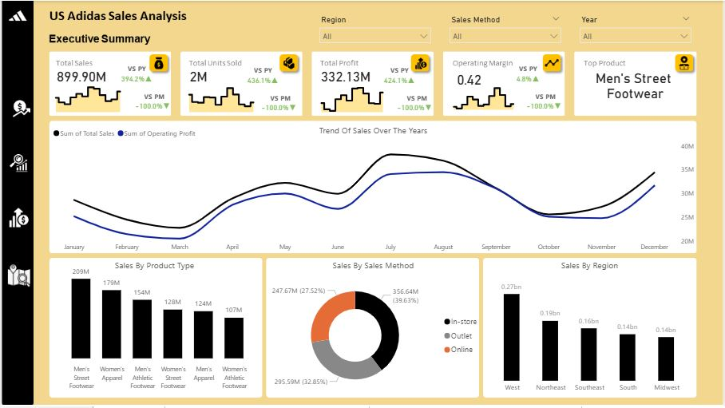
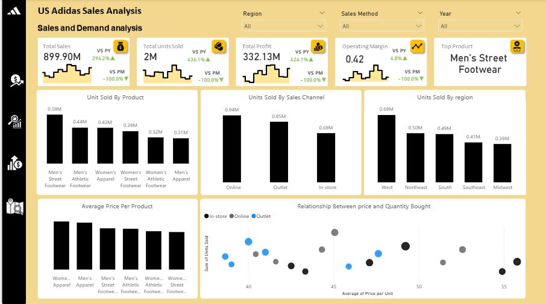
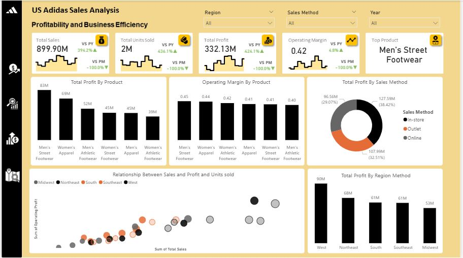
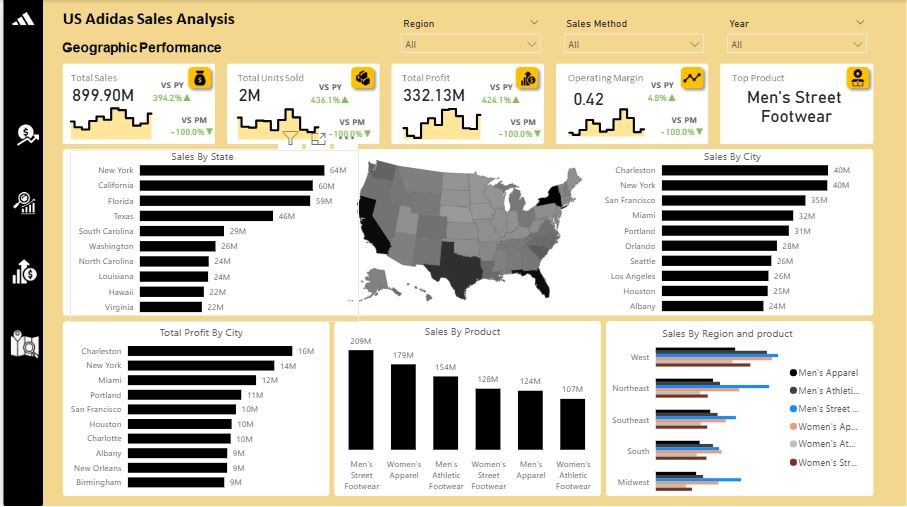

# Us-Adidas-Sales-Analysis

# Introduction
This project analyzes Adidas’ US sales performance in 2021 to understand the key drivers of revenue, demand, and profitability. Using interactive Power BI dashboards, the analysis examines sales trends across products, sales channels, and geographic regions, with the goal of turning raw sales data into actionable business insights. The findings highlight where Adidas is performing strongly and where strategic opportunities exist to optimize growth and efficiency.
# Problem Statement
  - Despite recording strong overall sales, Adidas faces several strategic questions that cannot be answered by topline revenue alone:
    - Which product categories are truly driving both sales volume and profitability?
    - How do sales channels (online, in-store, and outlet) differ in terms of customer behavior and profit contribution?
    - Which regions, states, and cities are performing exceptionally well, and which present untapped growth opportunities?
    - How does pricing influence demand, and where does price sensitivity impact unit sales?
    - Are growth and profitability evenly distributed, or concentrated in a few key products and locations?
    
Without clear answers to these questions, business decisions around inventory allocation, pricing, regional strategy, and channel optimization risk being driven by assumptions rather than evidence.
This project aims to address these challenges by analyzing Adidas’ US sales data to identify key performance drivers, demand patterns, and profit centers, ultimately providing insights and recommendations that can help improve operational efficiency and sustain long-term growth.
# Skills Demostrated
- Data Preparation'
- Data Cleaning
- DAX (YoY, MoM, PY, PM, etc)
- Data Modelling
- Dashboard Design (Power BI)
# Data Sourcung 
- The dataset was gotten  from Kaggle
- It contained 9,648 rows x 13 columns
# Data Transformation 
- The dataset was clean, so i dived into analysis proper
- I created measures for Total sales, Total Profit, Total Qunatity Sold, Operating Profit and top selling product
- I also created PM, PY, YOY and MoM values for each measure
# Analysis/Visualization
## Key Performance Indicators

- Total Revenue: $899.90M
- Total Units Sold: 2M
- Total Profut: $332.13M
- Operating Margin: 0.42
- Top Product: Men's Street Footwear
## Executive Summary

- Trend Of Sales and Profit Over the years
  - Sales were pretty low at the beginning of the year, it picked in march to April then fell in June, then rose to hit all time high in July and reduced till October, it then increased a bit till December
  - The relationship between sales and profit trend were the same with a bit difference in some months which might be due to promotions
- How products Sold
  - Men's Street Footwear Broght In the Most revenue with $209M
  - women's Apparel folowed with $174M, then Men's Athletic Footwear with $154M in revenue
  - Women's Street Footwear and Men's apparel came next with $128M and $124M respectively
  - Women's athletic Footwear brought in the least revenue with $107M in revenue
This shows the products that brought in the most money.
- Sales by Sales Method
  - In-store method accounted for most of revnue with 39.6% of total revenue
  - Outlets came next 32% of revenue amd Online mad the least in revnue with 27.52%
This shows the method in which people paid more money for goods.
- Sales By Region
  - The west contributed most to revenue with $269M coming from there
  - The NorthEast came next with $186M folowed by SouthEast with $163M in revenue
  - Then the South with $144.6M
  - The Midwest made least Revenue with $135M i revenue.
This shows us which part of the country spends the most.
## Sales Performance and Demand Analysis

- Unit Sold By Product
  - Men's Street Footwear was the most bought product with a total of 593K Units Sold
  - Men's Athletic Footwear and Women's Apparel came next with 436k and 434k units sold respectively
  - Women's Street Footwear and Women Athletic Footwear followed with 392k and 317k units sold.
  - The least bought Product was Men's apparel, selling 307k units.
This shows the demand of each Product
- Units Sold By Sales Channel
  - Customers bought the most Online claiming 939k units bought through Online Channel
  - Outlet Channel followed claimiing a total of 850k units.
  - In-store Channel was the least in number of product Bought claiming 690K units.
This shows the Channel that Customers find most comfortable to buy fromn
- Units Sold by Region
  - Customers from the west bought the most with 687k units bought from there.
  - NorthEast and South customers followed in Units bought with 501k and 492k units respectively
  - Customers from SouthEast came next with 407k units boght.]
  - The region wiith the the least units bought is th Midwest
This shows the level of demand from each region and the regions that buys more and the ones that buy less.
- How Price and Channel Affected Quantity Bought
## Profitability and Business Efficiency

- Total Profit By Product
  - Men's Street Footwear made most profiits with bringing in $83M
  - Women's Apparel and men's Athletic Foootwear followed with $69M and $52M respectively in profits.
  - Women's Street Footwear and Men's Apparel came next with $45M each made in profits
  - The Product that made the least profit is The Women's Athletic Footwear with $39M in profits.
This shows the product that are bringing back to the company after sales
- Operating Margin By product
  - Men's Street Footwear has the highest operating margin with 0.45
  - Followed by Women's Apparel with 0.44 operating margin
  - Women's athletic Footwear came next with 0.42 OM
  - Men's Apparel and Women's Streer Footwear followed with 0.41 Operating Margin
  - Men's Athletic Footwear has the lowest Operating Margin with o.40
THis shows the efficinecy of Each products.
- profit By Sales Method
  - In-store channels made the most in profits claiming 38.42% of total profits
  - Outlet Channel came next claiming 32% of Total Profits
  - Online channels contributed the least in profiits with 29% of Total.
- How Sales and Profits and Profits Relate
  - There is a Positive relation between the two as High sales translate to Hight Profits
## Geographic Analysis

- Sales By City
  - Customers From New York Spent the most with $64M coming in revenue from there
  - Carlifornia and Florida Came next and close with $60M and $59M in revenue
  - Texas followed with $49M in revenue
  - Others followed by a margin
- How regions bought Each Product
  - West
    - Highest: Men's Street Footwear
    - Lowest: Women's Street Footwear
  - Northeast
    - Highest: Men's Street Footwear
    - Lowest: Women's Street Footwear
  - Southeast
    - Highest: Men's Street Footwear
    - Lowest: Women's Street Footwear
  - South:
    - Highest: Men's Athletic Footwear
    - Lowest: Women's Apparel
  - Midwest:
    - Highest: Men's Street Footwear
    - Lowest: Women's Street Footwear
This shows which product is selling at which location
# Recommendation
